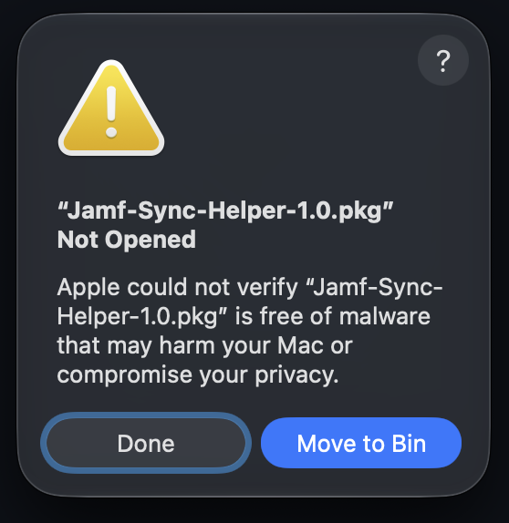
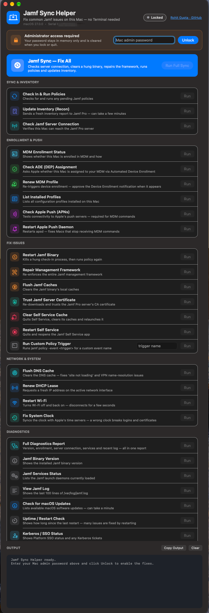

# 🛠️ Jamf Sync Helper

A native macOS utility that helps end users troubleshoot common **Jamf Pro** issues without using Terminal.

Jamf Sync Helper provides simple one-click actions for Jamf check-ins, inventory updates, MDM enrollment, Jamf services, network troubleshooting, diagnostics, and common fixes.


## 💻 Requirements

- macOS 13 or later
- Local Mac administrator account
- Mac enrolled in Jamf Pro for Jamf-specific actions

## 📦 Download & Install

### 👤 Manual Installation

1. Download **`Jamf-Sync-Helper-1.0.pkg`** from this repository.
2. Open the `.pkg` file and follow the installation prompts.
3. macOS Gatekeeper will block the package because it is not notarized.

   You may see the following message:

   

4. Click **Done** on the warning dialog.
5. Open **System Settings → Privacy & Security**.
6. Scroll down and select **Open Anyway** for `Jamf-Sync-Helper-1.0.pkg`.
7. Confirm the prompt and continue with the installation.
8. The application will be installed in `/Applications`.
9. Open **Jamf Sync Helper**.
10. Enter your Mac administrator password.
11. Click **Unlock** and select the required troubleshooting action.

> ⚠️ **Important:** The **Open Anyway** option is only required when installing the package manually. The package can also be deployed through an MDM solution.

### 🏢 MDM Deployment

For deployment through your MDM solution, you can use the package identifier:

```text
com.rohitg40.jamfsynchelper
```

You can use the identifier above or replace it with your own, for example:

```text
com.yourcompanyname.jamfsynchelper
```

This allows the package to be installed remotely through your MDM solution without requiring the user to manually open the package.

## ⚙️ How It Works

First Look of App:

   

After unlocking the application:

- 🔐 Enter your Mac administrator password.
- ▶️ Select a troubleshooting action.
- 🖥️ The required command runs automatically with administrator privileges.
- 📋 Command output is displayed in the built-in console.
- ⏹️ Use **Stop** to cancel a running command.
- 📄 Use **Copy Output** to copy the console output for support tickets.

The administrator password is held in memory only and is cleared when the application is locked, closed, or automatically locked after 15 minutes of inactivity.

The application also displays the Mac's macOS version and serial number to help IT identify the device from a screenshot.

## 🔧 Available Actions

### 🔄 Sync & Inventory

- Check In & Run Policies
- Update Inventory (Recon)
- Check Jamf Server Connection

### 📱 Enrollment & Push

- MDM Enrollment Status
- Check ADE (DEP) Assignment
- Renew MDM Profile
- List Installed Profiles
- Check Apple Push (APNs)
- Restart Apple Push Daemon

### 🛠️ Fix Issues

- Restart Jamf Binary
- Repair Management Framework
- Flush Jamf Caches
- Trust Jamf Server Certificate
- Clear Self Service Cache
- Restart Self Service
- Custom Policy Trigger

### 🌐 Network & System

- Flush DNS Cache
- Renew DHCP Lease
- Restart Wi-Fi
- Fix System Clock

### 🔍 Diagnostics

- Full Diagnostics Report
- Jamf Binary Version
- Jamf Services Status
- View Jamf Log
- Check for macOS Updates
- Uptime / Restart Check
- Kerberos / SSO Status
- Jamf Connect Password Sync Check
- Disk Space Check

## 🚀 Fix All

The **Jamf Sync — Fix All** action performs the following sequence:

```text
🔍 Check Jamf Server Connection
              ↓
🛑 Kill Hung Jamf Binary
              ↓
🔄 Jamf Manage
              ↓
📋 Jamf Policy
              ↓
📊 Jamf Recon
```

This provides a quick way to perform the most common Jamf synchronization and inventory recovery steps.

## 📖 Commands

The exact command used by each button is documented in:

**📄 [COMMANDS.md](COMMANDS.md)**

This file provides a reference for IT administrators who need to understand what each troubleshooting action performs.

## 📦 Package

The repository includes the ready-to-install package:

**`Jamf-Sync-Helper-1.0.pkg`**

No Xcode or build tools are required for end users.

## 👤 Author

**Rohit Gupta**

GitHub: [rohitg40](https://github.com/rohitg40)
